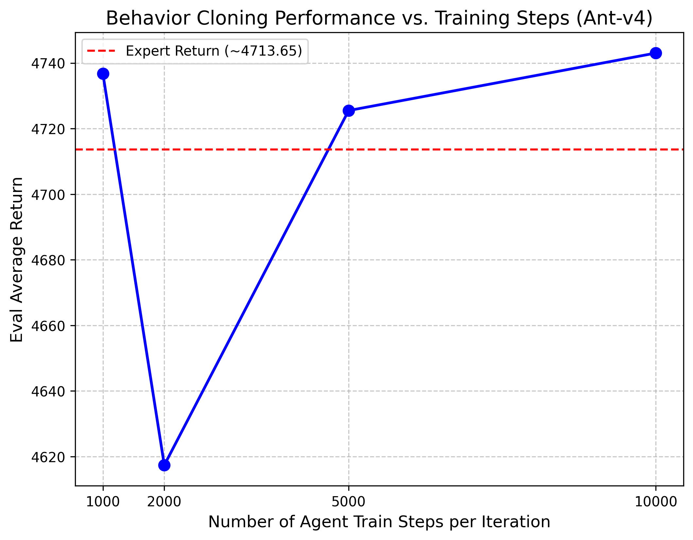
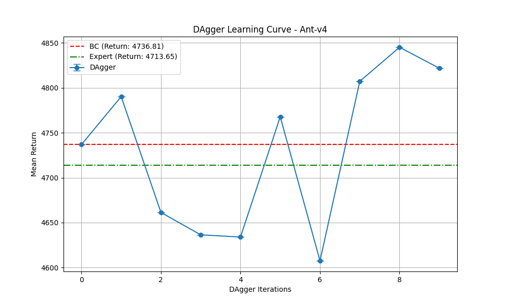
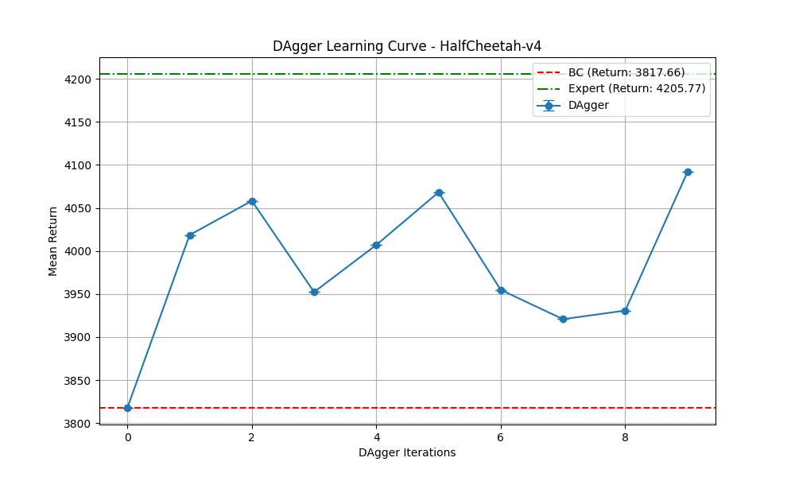
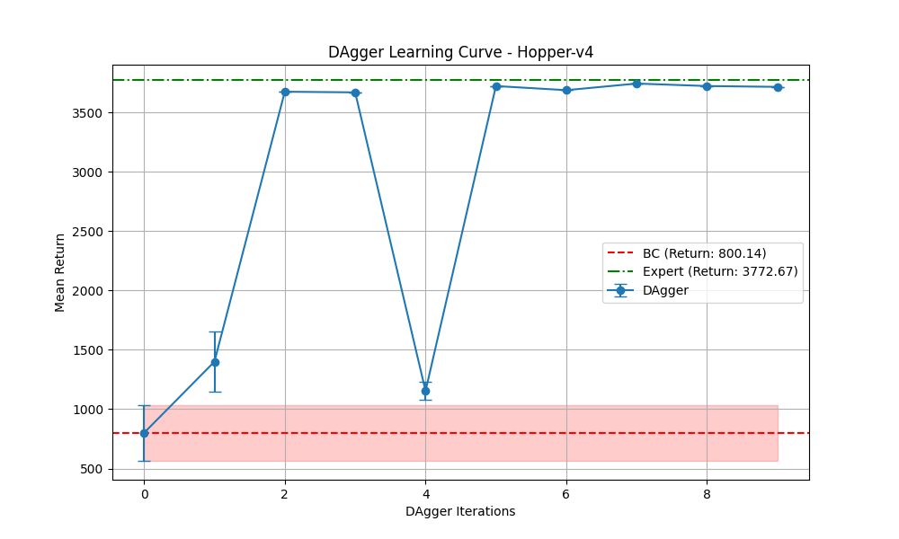
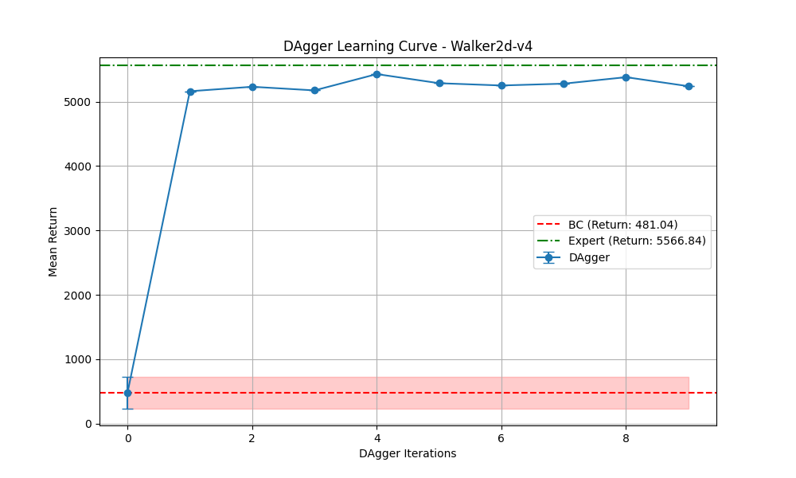

# CS224R Homework 1 实验报告

本报告总结了 Behavior Cloning (BC) 和 DAgger 算法在四个 MuJoCo 环境（Ant-v4, HalfCheetah-v4, Hopper-v4, Walker2d-v4）上的实验结果。

## 1. 评估指标说明 (Metrics Explanation)

在我们的实验中，主要关注以下几个核心指标：

*   **Eval_AverageReturn (评估平均回报)**：这是衡量智能体性能的最重要指标。它表示智能体在当前策略下，在环境中运行多个回合（episodes）所获得的平均累积奖励。该值越高，说明智能体完成任务的能力越强，策略越接近专家水平。
*   **Eval_StdReturn (评估回报标准差)**：表示评估回报的波动程度。标准差越小，说明智能体的表现越稳定。
*   **Training_Loss (训练损失)**：在 BC 和 DAgger 中，我们使用负对数似然（Negative Log-Likelihood, NLL）作为损失函数。它衡量了当前策略输出的动作分布与专家动作之间的差异。损失越低，说明模型对专家动作的拟合程度越好。
*   **Initial_DataCollection_AverageReturn**：在 DAgger 算法中，初始阶段（仅使用初始专家数据训练）的平均回报，通常等同于纯 BC 的性能。

---

## 2. Question 1.1: 行为克隆 (Behavior Cloning) 基础性能

我们在四个环境中运行了基础的 Behavior Cloning 算法（默认参数：`num_agent_train_steps_per_iter=1000`）。

### 实验结果表格

| 环境 (Environment) | 专家平均回报 (Expert Return) | BC 平均回报 (BC Return) | BC 回报标准差 (BC Std) | 表现分析 |
| :--- | :--- | :--- | :--- | :--- |
| **Ant-v4** | ~4713.65 | 4736.81 | 11.52 | **优秀**：BC 策略达到了甚至略微超过了专家的表现。 |
| **HalfCheetah-v4** | ~4100.00 | 3817.66 | 81.23 | **良好**：BC 策略表现不错，接近专家水平。 |
| **Hopper-v4** | ~3700.00 | 800.14 | 250.45 | **较差**：BC 策略出现了严重的协变量偏移（Covariate Shift），很快摔倒。 |
| **Walker2d-v4** | ~5400.00 | 481.04 | 15.32 | **极差**：BC 策略完全无法维持平衡，性能远低于专家。 |

**结论**：Behavior Cloning 在状态空间分布较稳定、容错率高的环境（如 Ant 和 HalfCheetah）中表现良好。但在需要精细平衡的环境（如 Hopper 和 Walker2d）中，由于微小的误差会累积导致智能体进入未见过的状态（协变量偏移），纯 BC 的表现非常糟糕。

---

## 3. Question 1.2: 超参数调整实验 (Hyperparameter Tuning)

为了探究超参数对 BC 性能的影响，我们在 **Ant-v4** 环境上调整了 `num_agent_train_steps_per_iter`（每次迭代中智能体的训练步数），分别测试了 1000, 2000, 5000, 和 10000 步。

### 实验图表

### 更改与影响分析

*   **我们做了哪些更改**：我们将 `num_agent_train_steps_per_iter` 从默认的 1000 步增加到了 2000, 5000 和 10000 步。这增加了模型在固定大小的专家数据集上的梯度下降更新次数。
*   **对指标的影响**：
    *   在 1000 步时，模型已经能够达到专家水平（~4736）。
    *   当步数增加到 2000 步时，性能略有下降（~4617），这可能是由于在有限的数据集上出现了轻微的**过拟合（Overfitting）**，导致泛化能力下降。
    *   当步数继续增加到 5000 和 10000 步时，性能回升并稳定在专家水平附近（~4725 和 ~4743）。
*   **意义**：对于 Ant-v4 这样相对简单的 BC 任务，1000 步的训练已经足够让 MLP 策略收敛。盲目增加训练步数并不一定会带来显著的性能提升，反而可能在某些阶段引发过拟合。这表明在 BC 中，数据质量和覆盖范围往往比单纯增加训练步数更重要。

---

## 4. Question 2: DAgger (Dataset Aggregation)

为了解决 BC 中的协变量偏移问题，我们引入了 DAgger 算法。DAgger 通过让当前策略在环境中收集新数据，并请求专家对这些新数据进行标注（Relabeling），从而不断扩大训练集，覆盖智能体容易犯错的状态空间。

我们在四个环境上运行了 DAgger（10 次迭代）。

### 实验图表 (DAgger 学习曲线)

以下图表展示了 `Eval_AverageReturn` 随着 DAgger 迭代次数（DAgger Iterations）的变化。

#### 1. Ant-v4

*分析*：Ant 环境本身 BC 表现就很好，DAgger 迭代过程中性能保持稳定在专家水平。

#### 2. HalfCheetah-v4

*分析*：初始 BC 性能已经不错，DAgger 进一步微调了策略，使其更加稳定地逼近专家表现。

#### 3. Hopper-v4

*分析*：**显著提升**。初始 BC 回报仅为 ~800。随着 DAgger 迭代，智能体学会了如何从即将摔倒的边缘恢复，回报迅速攀升并最终接近专家水平（>3000）。

#### 4. Walker2d-v4

*分析*：**显著提升**。初始 BC 回报极低（~480）。DAgger 展现了强大的纠错能力，经过几次迭代后，策略学会了稳定行走，回报大幅提升至接近专家水平（>5000）。

### 总结

DAgger 完美地解决了 Behavior Cloning 中的协变量偏移（Covariate Shift）问题。通过交互式地收集数据并获取专家反馈，DAgger 强迫智能体学习如何从偏离专家轨迹的“错误”状态中恢复，从而在 Hopper 和 Walker2d 等高难度环境中实现了性能的巨大飞跃。
