# CS336 Assignment 1: LLM Training Flow

This repository contains the implementation of a Decoder-only Large Language Model (LLM) training and inference pipeline.

## Architecture Overview

The following diagram illustrates the complete flow from data preparation to model inference, highlighting the first principles of each component.

